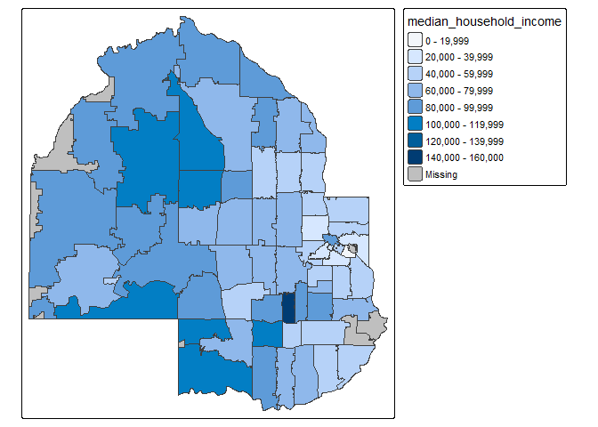

# Day 11 - Homework Responses
Armand Bashige

## Preliminaries

    Reading layer `Zip_Codes' from data source 
      `C:\Users\bashi\OneDrive\Documents\DST490\2025sem2-Bashigea\day11\shapefiles\Zip_Codes' 
      using driver `ESRI Shapefile'
    Simple feature collection with 75 features and 5 fields
    Geometry type: MULTIPOLYGON
    Dimension:     XY
    Bounding box:  xmin: 439356.4 ymin: 4959128 xmax: 486031.7 ymax: 5010414
    Projected CRS: NAD83 / UTM zone 15N

Link to google doc for instructions:
[LINK](https://docs.google.com/document/d/1shtTHzs8y09XZd86nKNFVSGjtsa-s8XVoalSJ5kyDpk/edit?usp=sharing)

## (20 points) Code of Ethics

I’m interested in understanding your process for completing all the
questions in this assignment. Please tell me about the tools and
resources—including any use of AI—that helped you with your work. Please
remember to follow the outlined [Code of
Ethics](https://docs.google.com/document/d/1lMvzPTGUAaMnH0KPibShQ1ualuo8uqICCexkh8zmsW8/edit?usp=sharing).
Because our understanding of how to work with AI tools is emerging,
please err on the side of including too much detail rather than too
little.

For this assignment, I primarily used the Day 11 class activity code as
my main resource for completing the coding portions, especially for
Problem 3 where I followed the professor’s exact code structure and only
changed the variable from population to median household income. For the
reading reflections in Problems 1 and 2, I read through the assigned
chapters and used what I learned to write my responses in my own words.
I also used Claude (AI assistant) to help me organize and write out my
responses, and to help me think through some of the coding questions.
All of the code I submitted is based on the class activity code provided
by the professor, and I made sure to understand what each line was doing
before using it in my homework.

## Problem 1 (10 points)

Review [Chapter 18 in Modern Data Science with
R](https://mdsr-book.github.io/mdsr2e/ch-spatial2.html). Now that we
have had a few days on shapefiles and maps, what interesting things did
you learn about working with shapefiles?

Reading Chapter 18 taught me a lot of interesting things about working
with shapefiles that go beyond just making maps. One thing I found
really cool is that you can convert a regular address into geographic
coordinates using a process called geocoding, which is done with the
geocode() function. This means you can take any address and turn it into
a point on a map without having to manually look up the coordinates
yourself.

I also learned that you can compute real measurements from shapefiles,
like the area of a piece of land or the length of a trail, using
functions like st_area() and st_length(). What surprised me is that you
can even calculate the distance between two locations, either as a
straight line or as an actual driving or biking route. This feels very
powerful because it means shapefiles are not just for visualization but
can also answer real world questions.

## Problem 2 (10 points)

Read Chapters 1 and 2 and skim a few other chapters of interest from
[Analyzing US Census Data: Methods Maps, and Models in
R](https://walker-data.com/census-r/index.html). What did you learn
about the US Census Data and how could you use that to level up your
data science skills?

Reading Chapters 1 and 2 of Analyzing US Census Data taught me that the
US Census Bureau collects a huge amount of information about people in
the United States, and that R is actually a really great tool for
working with all of that data. I learned that there are two main types
of census data. The first is the Decennial Census, which happens every
10 years and counts every single person in the country. The second is
the American Community Survey or ACS, which is sent out every year to
about 3.5 million households and collects more detailed information
about things like income, education, housing, and employment.

One thing that really stood out to me is how the tidycensus package
makes it very easy to pull census data directly into R with just a few
lines of code. Instead of going to a website and downloading files
manually, you can use functions like get_acs() to grab data for a
specific place and year, and load_variables() to search through
thousands of available variables to find exactly what you need. This
saves a lot of time and keeps everything in one place.

For leveling up my data science skills, I think this could be really
useful for our Hennepin County project. We could pull variables like
median household income, education levels, or housing costs at the
census tract level and combine them with the shapefiles we already have
to make more detailed and meaningful maps of different neighborhoods in
Hennepin County.

## Problem 3 (20 points)

In our work in class, when we glimpsed the data frame `hennepin_zips`,
more data than just population was included. Select another variable and
make an aggregate chlorpleth map of the zip code areas for Hennepin
County. Use either `ggplot`, `mapview`, or `tmap`.

## Problem 4 (20 points)

(10 points) The R package
[tidycensus](https://walker-data.com/tidycensus/index.html) has
information at the census tract level from the American Community Survey
or the Decennial census. Read through the basic usage of this package:
[LINK](https://walker-data.com/tidycensus/articles/basic-usage.html).

Discuss with your Hennepin County group the types of variables collected
from the American Community Survey. What variables might be of use in
your project. (One person can submit on behalf of your group. Since you
are submitting individual homework, if you aren’t the person submitting,
please tell me who is submitting in your response.)

I encourage you to start working with this package - notice that you
need an API key, but it is easy to obtain.

After reading through the basic usage of the tidycensus package, I
learned that the American Community Survey collects a very wide range of
variables about the US population. You can search through all of them
using the load_variables() function in R to find exactly what you need
without having to go to the Census website.

For our Hennepin County project, our group is focusing on poverty and
SNAP participation, so the ACS variables that would be most useful
include poverty rates by census tract, SNAP and food stamp participation
rates, median household income, and household composition especially
families with children. These variables would help us directly answer
our research questions, such as whether there are places with high
poverty but low SNAP participation, and whether some low income
neighborhoods are being left out of assistance programs.

I was not able to discuss this with my group before the submission
deadline. However, based on our project focus, I believe these variables
would be the most relevant starting point for our analysis. Going
forward, I plan to use get_acs() with these variables at the census
tract level for Hennepin County to start building out our data, and I
will share my findings with the group.
